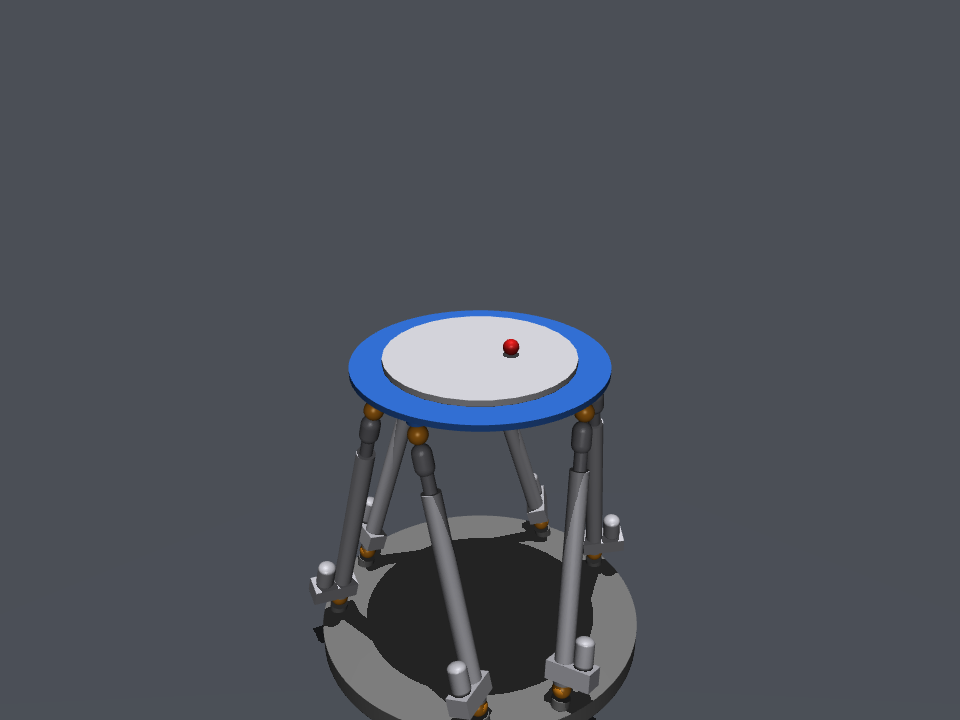

# Stewart Platform — Ball Balancing & Bouncing

A 6-DOF Stewart platform (hexapod) in [MuJoCo](https://mujoco.org/) that
balances and bounces a ball on a tray, controlled by a task-space **sliding-mode
controller** (SMC) on the platform pose plus an outer PID that converts ball
position error into a tray tilt.

<p align="center">
  
</p>

## Install

```bash
python3 -m venv .venv && source .venv/bin/activate
pip install -r requirements.txt
```

No compilation step — the controller model is pure NumPy/SciPy.

## Run

From the repo root:

```bash
python -m demos.balance_ball          # ball balancing, live viewer
python -m demos.bounce_ball           # ball bouncing, live viewer

python -m demos.balance_ball --video  # render to outputs/balance.mp4 (headless)
python -m demos.bounce_ball  --video  # render to outputs/bounce.mp4
```

Flags: `--duration <seconds>`, `--video [path]`, `--fps <n>`. Headless machines
should use `--video` (offscreen render); set `MUJOCO_GL=egl` if needed.

## How it works

```
ball (x,y) error ──▶ BallBalancingController (PID) ──▶ (roll, pitch) reference
                                                              │
upper-platform pose/twist ──▶ SlidingModeController (SMC) ◀───┘
                                       │
                                       ▼
                              6 leg forces ──▶ MuJoCo
```

- **Inner loop — `SlidingModeController`**: task-space computed-force SMC. Uses the
  platform Jacobian, task-space mass matrix and gravity wrench (from
  `StewartModel`) to produce the six leg forces that track a desired platform
  pose `[x, y, z, roll, pitch, yaw]`.
- **Outer loop — `BallBalancingController`**: two PIDs map ball position/velocity
  error on the tray to a `(roll, pitch)` reference for the platform.

## Layout

```
model/      MuJoCo model — platform.xml (robot + tray) and scene_{balance,bounce}.xml
stewart/    python package: model, controllers (smc, ball), sim harness, config
demos/      runnable entry points: balance_ball.py, bounce_ball.py
outputs/    rendered videos
```

The platform geometry and the upper-platform mass/inertia used for control
design are recorded in `stewart/config.py`, taken directly from the MJCF model.

## License

MIT (see `model/LICENSE`). Platform model by
[Duc Cuong Vu](https://github.com/duccuongvu) and
[Viet Khanh Nguyen](https://github.com/vietkhanh-nguyen).
